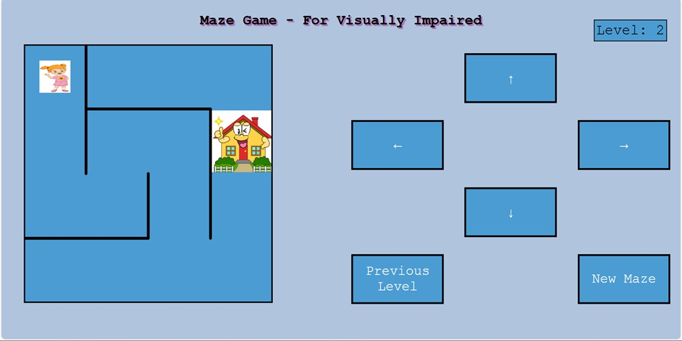

# 🧠 SenseRoute – AI-Powered Assistant for the Visually Impaired

**SenseRoute** is a smart, assistive virtual assistant built for the visually impaired, providing real-time environmental awareness, object recognition, voice interaction, and emergency alerting. It empowers users to navigate the world more independently and safely using AI and speech technologies.

---

## ✨ Key Features

- 🎯 **Object Detection**: Detects and recognizes real-world objects using **YOLOv8** and **OpenCV**.
- 🗣️ **Text-to-Speech (TTS)**: Converts scene/object data into speech for auditory feedback.
- 📧 **Emergency Email Alerts**: Sends alerts with detected object descriptions and timestamps to a registered guardian via Gmail API.
- 🔊 **Voice Command Integration**: Interacts via custom voice commands (e.g., "describe environment", "detect object", etc.).
- 📰 **Location-Based News Updates**: Reads out the latest news headlines specific to the user's city.
- 📄 **OCR (Optical Character Recognition)**: Reads and speaks out text from images or captured scenes.
- 🎮 **Maze Game**: A fun, brain-engaging game to enhance spatial thinking.
- 📷 **Scene Description**: Captures and summarizes the full scene around the user.
- 🔒 **Secure & Private**: Sensitive data like API tokens are excluded from the repository.

---

## 📦 Tech Stack

- **Frontend**: React.js + Tailwind CSS + ShadCN UI + Framer Motion
- **Backend**: Python (Flask), Node.js (optional for API handling)
- **AI & Vision**: YOLOv8, OpenCV, Tesseract OCR
- **Voice**: gTTS / pyttsx3, SpeechRecognition
- **APIs Used**:
  - Gmail API (for alerts)
  - NewsAPI (for headlines)
  - OpenWeather API (optional for weather)
- **Other Tools**:
  - GitHub Actions (CI/CD)
  - Google OAuth (secure access)
  - Git Filter Repo (secret removal)

---

## 📂 Folder Structure

```bash
SenseRoute/
├── frontend/                # React UI
├── assistant-backend/      # Python Flask backend
│   ├── object_detection/   # YOLOv8 integration
│   ├── ocr_module/         # Tesseract OCR logic
│   ├── email_service/      # Gmail API handling
│   └── news_module/        # Location-based news reader
├── .spyder-py3/            # Local config (ignored in Git)
├── credentials.json        # (ignored) Google OAuth credentials
├── token.json              # (ignored) Gmail API token
├── README.md
└── .gitignore


---

## 🧩 Maze Game – For Visually Impaired Users



The **Maze Game** in SenseRoute is a blind-accessible puzzle designed to enhance spatial awareness, problem-solving, and confidence using audio cues and keyboard input.

---

### 🔍 What It Does

It enables visually impaired users to explore and solve mazes by listening to spatial sound feedback and navigating using keyboard keys — no screen interaction required.

---

### 🎧 Core Features

✅ **Spatial Audio Guidance**  
- As the player (a girl icon) gets closer to the goal (🏠), the goal sound increases in volume.  
- When hitting a wall, directional sound cues help users perceive spatial layout.

✅ **Keyboard-Based Navigation**  
- Press **Shift** to rotate movement options (↑ ↓ ← →).  
- Press **Enter** to confirm the selected direction.  
- Entirely hands-free, screen-free gameplay.

✅ **Maze Generation**  
- Uses a **depth-first search (DFS)** algorithm for maze generation.  
- Every maze is solvable and uniquely created.

✅ **Level Progression**  
- 4 levels of difficulty.  
- Each level includes 3 mazes (12 total).  
- Unlock new levels by completing previous ones.

✅ **Replayability**  
- Click **“New Maze”** anytime to refresh the layout.  
- Go back and replay earlier levels to practice.

---

### 🎯 Goal

Help the user reach the **destination (home 🏠)** using only **audio guidance** and a **keyboard interface**. Each maze completed builds auditory-motor coordination, spatial reasoning, and personal achievement.


